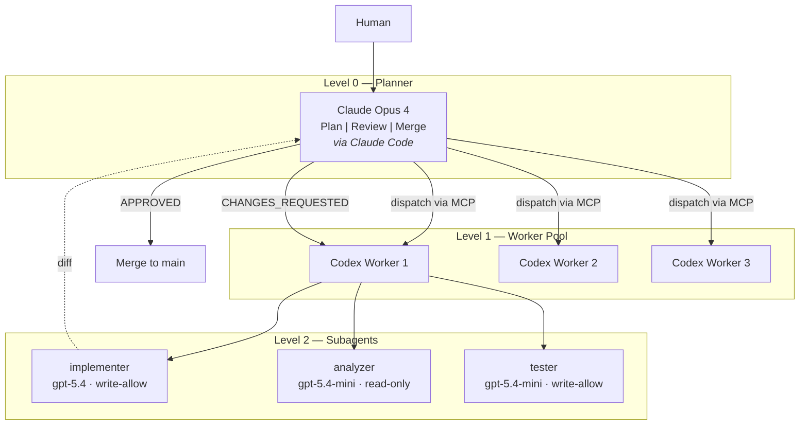

# Multi-Agent Dev Framework

Zero-custom-code multi-agent development framework: Claude Opus plans and reviews, Codex CLI workers implement in parallel.

[](LICENSE)
[](CONTRIBUTING.md)

[中文](README_CN.md) | **English**

## Why This Framework

- **Zero custom code** -- pure configuration, no orchestration scripts. Codex CLI + MCP bridge = self-contained workers.
- **Adversarial review loop** -- Claude reviews GPT output, catches errors before merge. Up to 3 review iterations.
- **Parallel execution** -- up to 3 workers running simultaneously, each in its own git worktree. No merge conflicts.
- **Model-specific roles** -- expensive models (gpt-5.4) for complex implementation, cheaper models (gpt-5.4-mini) for constrained analysis and testing.

## Architecture



### Orchestration Flow

```
Human Request
  → Claude Opus plans approach
  → Plan reviewed
  → Dispatches 1-3 Codex Workers (parallel, via MCP)
    → Each worker spawns analyzer/implementer/tester subagents
    → Workers implement in isolated git worktrees
  → Claude Opus reviews all diffs (adversarial review)
  → APPROVED or CHANGES_REQUESTED (max 3 iterations)
  → Merged to main
```

## Prerequisites

| Tool | Purpose | Install |
|------|---------|---------|
| [Claude Code](https://docs.anthropic.com/en/docs/claude-code) | Level 0 planner/reviewer | `npm i -g @anthropic-ai/claude-code` |
| [Codex CLI](https://github.com/openai/codex) | Level 1 workers | `npm i -g @openai/codex` |
| [codex-as-mcp](https://github.com/kky42/codex-as-mcp) | MCP bridge | auto-installed via `uvx` |
| tmux (optional) | Session management | `apt install tmux` / `brew install tmux` |

### Subscriptions

- 1x **Claude Max** (Opus 4) -- planner and reviewer
- 1-3x **ChatGPT Plus** -- worker pool (each account = 1 Codex worker)

## Quick Start

```bash
# 1. Install Codex CLI
npm i -g @openai/codex

# 2. Login to your GPT Plus account(s)
codex login

# 3. Register the MCP bridge in Claude Code
claude mcp add codex-sub -- uvx codex-as-mcp@latest
```

Done. Claude Code can now dispatch Codex workers via MCP.

## Using in a New Project

### Step 1: Copy framework files

```bash
cp -r ~/multi-agent-dev-framework/{codex.toml,.codex,docs,notes} /path/to/your-project/
```

This adds the following structure to your project:

```
your-project/
├── codex.toml                            # Codex project config
├── .codex/
│   ├── agents/
│   │   ├── implementer.toml              # Code writer (gpt-5.4)
│   │   ├── analyzer.toml                 # Read-only analyzer (gpt-5.4-mini)
│   │   └── tester.toml                   # Test writer (gpt-5.4-mini)
│   └── skills/
│       └── repo-working-memory/          # Persistent context skill
│           ├── SKILL.md
│           ├── scripts/
│           │   ├── init-worklog.sh
│           │   └── check-complete.sh
│           └── templates/
│               ├── task_plan.md
│               ├── findings.md
│               └── progress.md
├── docs/skills/
│   └── external-skill-review.md          # Skill governance policy
└── notes/working-memory/                 # Task tracking (gitignore or commit)
```

### Step 2: Customize codex.toml (optional)

```toml
[model]
default = "gpt-5.4"          # or whichever model you prefer

[agents]
max_threads = 3               # increase if you have more GPT Plus accounts
max_depth = 1                  # keep flat, avoid nesting explosions

[sandbox]
mode = "write-allow"
```

### Step 3: Add an AGENTS.md to your project (recommended)

Create a minimal `AGENTS.md` in your project root so workers understand the project:

```md
# Repo Notes

- Language: Python 3.12 / TypeScript 5.x
- Run tests with: `pytest -q` / `npm test`
- Run lint with: `ruff check .` / `eslint .`
- Keep patches minimal.
- Do not edit generated files unless explicitly asked.
```

### Step 4: Start developing

```bash
# In your project directory:
claude                         # starts Claude Code (planner)

# Claude will dispatch workers via MCP automatically when you ask it to
# implement features in parallel
```

## Workflow Patterns

### Pattern A: Single Feature

```
You → Claude: "Implement feature X"
Claude → Plans the approach
Claude → Dispatches implementer worker via MCP
Claude → Reviews the diff
Claude → Approves or requests changes
```

### Pattern B: Parallel Implementation

Best for larger tasks with independent components.

```
You → Claude: "Implement features X, Y, Z in parallel"

Claude dispatches:
  Worker 1 (implementer) → Feature X
  Worker 2 (implementer) → Feature Y
  Worker 3 (implementer) → Feature Z

Claude reviews all diffs → merge
```

### Pattern C: Full Pipeline with Subagents

```
You → Claude: "Implement feature X with analysis first"

Claude dispatches Worker 1:
  └── analyzer subagent → reports dependencies and interfaces
  └── implementer subagent → writes code based on analysis
  └── tester subagent → writes and runs tests

Claude reviews combined output → merge
```

## Working Memory

For complex tasks spanning multiple sessions, use the built-in working memory skill:

```bash
# Initialize tracking for a new task
sh .codex/skills/repo-working-memory/scripts/init-worklog.sh my-feature

# This creates:
# notes/working-memory/my-feature/task_plan.md   -- goal, phases, decisions
# notes/working-memory/my-feature/findings.md    -- facts, constraints
# notes/working-memory/my-feature/progress.md    -- action log, test results

# Check if all phases are complete
sh .codex/skills/repo-working-memory/scripts/check-complete.sh my-feature
```

## Configuration Reference

### codex.toml (project-level)

| Parameter | Default | Description |
|-----------|---------|-------------|
| `model.default` | `gpt-5.4` | Default model for root agent |
| `agents.max_threads` | `3` | Max concurrent subagent threads per worker |
| `agents.max_depth` | `1` | Nesting depth (1 = direct children only) |
| `sandbox.mode` | `write-allow` | Default sandbox mode |

### Agent Configs

| Agent | Model | Sandbox | Role |
|-------|-------|---------|------|
| `implementer` | gpt-5.4 | write-allow | Writes production code |
| `analyzer` | gpt-5.4-mini | read-only | Analyzes dependencies and interfaces |
| `tester` | gpt-5.4-mini | write-allow | Writes and runs tests |

### Codex CLI Profiles (~/.codex/config.toml)

Recommended profiles for daily use:

```toml
[profiles.dev]
model = "gpt-5.4"
approval_policy = "on-request"
sandbox_mode = "workspace-write"
model_reasoning_effort = "medium"
model_verbosity = "medium"
web_search = "disabled"

[profiles.review]
model = "gpt-5.4"
approval_policy = "on-request"
sandbox_mode = "read-only"
model_reasoning_effort = "high"
model_verbosity = "medium"
web_search = "disabled"
```

Usage:
- `codex -p dev` -- daily implementation
- `codex -p review` -- read-only investigation or code review

## Skill Governance

Before installing external Codex skills, review them against the policy in `docs/skills/external-skill-review.md`:

- **Allow**: Official `openai/skills` for bounded tasks
- **Fork-first**: Community skills that shape workflow behavior
- **Deny**: Deployment/upload skills, unmaintained projects, `curl|bash` installers

## Anti-Patterns

- Don't default to `danger-full-access` sandbox mode
- Don't enable network access unless explicitly needed
- Don't run multiple agents in the same worktree simultaneously
- Don't nest subagents deeper than 1 level
- Don't skip the review loop -- adversarial review is what makes this work

## File Reference

| File | Purpose |
|------|---------|
| `codex.toml` | Project-level Codex config (model, threads, sandbox) |
| `.codex/agents/implementer.toml` | GPT-5.4 code writer subagent |
| `.codex/agents/analyzer.toml` | GPT-5.4-mini read-only analyzer subagent |
| `.codex/agents/tester.toml` | GPT-5.4-mini test writer subagent |
| `.codex/skills/repo-working-memory/` | Persistent context tracking skill |
| `docs/skills/external-skill-review.md` | External skill governance policy |
| `notes/working-memory/` | Active task tracking directory |

## Key Design Decisions

1. **Zero custom code**: Codex CLI + MCP = self-contained workers. No orchestration scripts needed.
2. **Conservative concurrency**: `max_threads=3, max_depth=1` prevents quota drain and nesting explosions.
3. **Model-specific roles**: gpt-5.4 for complex implementation, gpt-5.4-mini for constrained analysis/testing.
4. **Repo-local memory**: Working memory stays in the repo, never scrapes home-directory or session files.
5. **Flat hierarchy**: Direct children only, no grandchildren. Keeps execution predictable.

## tmux Setup (Optional)

Minimal `~/.tmux.conf` for multi-pane development:

```tmux
set -g mouse on
set -g history-limit 100000
set -g renumber-windows on
set -g base-index 1
setw -g pane-base-index 1

set -g status-position bottom
set -g allow-passthrough on

bind r source-file ~/.tmux.conf \; display-message "tmux reloaded"
bind | split-window -h -c "#{pane_current_path}"
bind - split-window -v -c "#{pane_current_path}"
bind c new-window -c "#{pane_current_path}"
```

Recommended layout:
- **Pane 1**: `claude` (planner) or `codex -p dev` (worker)
- **Pane 2**: `pytest -f` / `npm test -- --watch` / server logs

## References

- [Codex CLI](https://github.com/openai/codex)
- [codex-as-mcp](https://github.com/kky42/codex-as-mcp)
- [Claude Code](https://docs.anthropic.com/en/docs/claude-code)
- [Claude Code Worktree Workflows](https://docs.anthropic.com/en/docs/claude-code/common-workflows)

## License

[MIT](LICENSE) -- fzhiy
