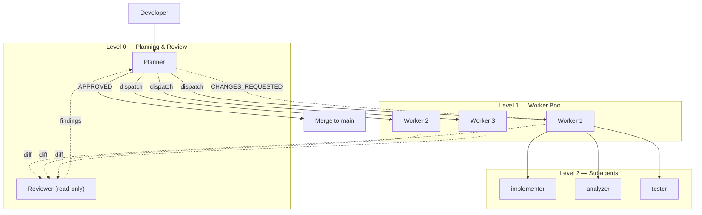

# Multi-Agent Dev Framework

Zero-custom-code multi-agent development framework: one agent plans and reviews, a pool of workers implements in parallel.

[](LICENSE)
[](CONTRIBUTING.md)

[中文](README_CN.md) | **English**

## Why This Framework

- **Zero custom code** -- pure configuration (TOML + Markdown skills), no orchestration scripts.
- **Adversarial review loop** -- the planner reviews worker output before merge. Up to 3 review iterations.
- **Parallel execution** -- up to 3 workers running simultaneously, each in its own git worktree. No merge conflicts.
- **Role-based cost optimization** -- expensive models for complex implementation, cheaper models for constrained analysis and testing.
- **Provider flexibility** -- run with Claude + GPT ([hybrid mode](#quick-start)) or GPT-only ([codex-only mode](#codex-only-mode)). Single subscription sufficient.

## Architecture



Each worker runs in an isolated git worktree on its own feature branch. The planner orchestrates the full lifecycle: **spec** → **plan** → **dispatch** → **review** → **merge** (with user approval at every gate).

### Implementation Modes

The architecture is provider-agnostic. This framework ships with two concrete implementations:

| Mode | Planner | Workers | Dispatch | Review | Guide |
|------|---------|---------|----------|--------|-------|
| **Hybrid** | Claude Code | Codex CLI | MCP bridge | Cross-model: Claude reviews GPT | [docs/hybrid-mode-guide.md](docs/hybrid-mode-guide.md) |
| **Codex-only** | Codex CLI | Codex native subagents | Native subagent | Same-model + reviewer agent | [docs/codex-only-guide.md](docs/codex-only-guide.md) |

- **Hybrid mode** -- strongest review quality through cross-model adversarial critique. Requires Claude Max + GPT Plus. See [hybrid mode guide](docs/hybrid-mode-guide.md).
- **Codex-only mode** -- single-subscription operation with GPT Plus only. Review quality mitigated by dedicated `reviewer` agent with mandatory checklist. See [codex-only mode guide](docs/codex-only-guide.md).

## Quick Start

### Hybrid Mode (Claude + Codex)

```bash
npm i -g @openai/codex          # Install Codex CLI
codex login                     # Login to GPT Plus
claude mcp add codex-sub -- uvx codex-as-mcp@latest  # Register MCP bridge
claude                          # Start Claude Code (planner)
```

Then drive the workflow: `/spec` → `/plan` → `/dispatch` → `/review-workers` → merge.

See [docs/hybrid-mode-guide.md](docs/hybrid-mode-guide.md) for full setup, prerequisites, and workflow patterns.

### Codex-Only Mode (GPT only)

```bash
npm i -g @openai/codex          # Install Codex CLI
codex login                     # Login to GPT Plus
# Edit codex.toml: set framework.mode = "codex-only"
codex                           # Start Codex (planner via AGENTS.md)
```

Then interact naturally: `"Write a spec for X"` → `"Create a plan"` → `"Dispatch workers"` → `"Review output"`.

See [docs/codex-only-guide.md](docs/codex-only-guide.md) for full setup, prerequisites, and workflow walkthrough.

## Using in a New Project

### Step 1: Copy framework files

```bash
cp -r ~/multi-agent-dev-framework/{codex.toml,.codex,.claude,docs,notes} /path/to/your-project/
```

For codex-only projects, you can skip `.claude/` if you do not need Claude Code slash commands.

This adds the following structure to your project:

```
your-project/
├── .claude/commands/                     # Claude Code slash commands (hybrid mode)
│   ├── spec.md                           # /spec — requirements → structured spec
│   ├── plan.md                           # /plan — spec → implementation plan
│   ├── dispatch.md                       # /dispatch — plan → Worker dispatch via MCP
│   ├── review-workers.md                 # /review-workers — review Worker output
│   └── status.md                         # /status — show task progress
├── .codex/
│   ├── agents/
│   │   ├── planner.toml                  # Planner/coordinator (codex-only)
│   │   ├── reviewer.toml                 # Adversarial reviewer (codex-only)
│   │   ├── implementer.toml              # Code writer (gpt-5.4)
│   │   ├── analyzer.toml                 # Read-only analyzer (gpt-5.4-mini)
│   │   └── tester.toml                   # Test writer (gpt-5.4-mini)
│   └── skills/
│       ├── codex-spec/                   # Structured spec generation (codex-only)
│       ├── codex-plan/                   # Implementation plan generation (codex-only)
│       ├── codex-dispatch/               # Worker dispatch via native subagents (codex-only)
│       ├── codex-review/                 # Adversarial review loop (codex-only)
│       ├── codex-status/                 # Task progress monitoring (codex-only)
│       ├── repo-working-memory/          # Persistent context tracking
│       ├── requirement-spec/             # Structured spec generation
│       ├── create-plan/                  # Implementation plan generation
│       └── task-dispatcher/              # Worker dispatch planning
├── AGENTS.md                             # Repo-specific notes for all agents
├── codex.toml                            # Codex project config
├── docs/
│   ├── codex-only-guide.md               # Detailed Codex-only setup and usage
│   └── skills/
│       └── external-skill-review.md      # Skill governance policy
└── notes/working-memory/                 # Task tracking (gitignore or commit)
```

### Step 2: Customize codex.toml (optional)

```toml
[model]
default = "gpt-5.4"          # or whichever model you prefer

[agents]
max_threads = 3               # increase if you have more GPT Plus accounts
max_depth = 1                  # keep flat, avoid nesting explosions

[sandbox]
mode = "write-allow"
```

### Step 3: Add an AGENTS.md to your project (recommended)

Create a minimal `AGENTS.md` in your project root so workers understand the project:

```md
# Repo Notes

- Language: Python 3.12 / TypeScript 5.x
- Run tests with: `pytest -q` / `npm test`
- Run lint with: `ruff check .` / `eslint .`
- Keep patches minimal.
- Do not edit generated files unless explicitly asked.
```

### Step 4: Start developing

```bash
# In your project directory:
claude                         # starts Claude Code (planner)

# Claude will dispatch workers via MCP automatically when you ask it to
# implement features in parallel
```

## Claude Code Slash Commands

The framework includes 5 slash commands for driving the multi-agent workflow from Claude Code:

| Command | Purpose | Stage |
|---------|---------|-------|
| `/spec <description>` | Transform a request into a structured spec with acceptance criteria | Requirements |
| `/plan [spec-path]` | Generate 6-12 atomic action items with parallelization groups | Planning |
| `/dispatch [plan-path]` | Create feature branches, dispatch Codex Workers via MCP | Implementation |
| `/review-workers [task]` | Review Worker diffs, run adversarial review via GPT-5.4 | Review |
| `/status [task]` | Show progress across all active multi-agent tasks | Monitoring |

Full development cycle:

```
/spec "build feature X"  →  /plan  →  /dispatch  →  /review-workers  →  merge
```

Every command has a confirmation gate -- no automatic pushes, no merges without approval.

## Codex Skills

| Skill | Purpose | Trigger |
|-------|---------|---------|
| `requirement-spec` | Vague request → structured spec | Auto-matched by Codex |
| `create-plan` | Spec → implementation plan with dependencies | Auto-matched by Codex |
| `task-dispatcher` | Plan → Worker assignments with branch strategy | Auto-matched by Codex |
| `repo-working-memory` | Persistent task tracking across sessions | Auto-matched by Codex |
| `codex-spec` | Structured spec generation (codex-only) | Auto-matched |
| `codex-plan` | Implementation plan generation (codex-only) | Auto-matched |
| `codex-dispatch` | Worker dispatch via native subagents (codex-only) | Auto-matched |
| `codex-review` | Adversarial review via reviewer agent (codex-only) | Auto-matched |
| `codex-status` | Task progress monitoring (codex-only) | Auto-matched |

## Workflow Patterns

### Pattern A: Single Feature

```
You → Claude: "Implement feature X"
Claude → Plans the approach
Claude → Dispatches implementer worker via MCP
Claude → Reviews the diff
Claude → Approves or requests changes
```

### Pattern B: Parallel Implementation

Best for larger tasks with independent components.

```
You → Claude: "Implement features X, Y, Z in parallel"

Claude dispatches:
  Worker 1 (implementer) → Feature X
  Worker 2 (implementer) → Feature Y
  Worker 3 (implementer) → Feature Z

Claude reviews all diffs → merge
```

### Pattern C: Full Pipeline with Subagents

```
You → Claude: "Implement feature X with analysis first"

Claude dispatches Worker 1:
  └── analyzer subagent → reports dependencies and interfaces
  └── implementer subagent → writes code based on analysis
  └── tester subagent → writes and runs tests

Claude reviews combined output → merge
```

## Working Memory

For complex tasks spanning multiple sessions, use the built-in working memory skill:

```bash
# Initialize tracking for a new task
sh .codex/skills/repo-working-memory/scripts/init-worklog.sh my-feature

# This creates:
# notes/working-memory/my-feature/task_plan.md   -- goal, phases, decisions
# notes/working-memory/my-feature/findings.md    -- facts, constraints
# notes/working-memory/my-feature/progress.md    -- action log, test results

# Check if all phases are complete
sh .codex/skills/repo-working-memory/scripts/check-complete.sh my-feature
```

## Configuration Reference

### codex.toml (project-level)

| Parameter | Default | Description |
|-----------|---------|-------------|
| `model.default` | `gpt-5.4` | Default model for root agent |
| `agents.max_threads` | `3` | Max concurrent subagent threads per worker |
| `agents.max_depth` | `1` | Nesting depth (1 = direct children only) |
| `sandbox.mode` | `write-allow` | Default sandbox mode |
| `framework.mode` | `hybrid` | Framework mode: `"hybrid"` or `"codex-only"` |
| `framework.enhanced_review` | `false` | Enable second-round MCP review in codex-only mode |

### Agent Configs

| Agent | Model | Sandbox | Role |
|-------|-------|---------|------|
| `planner` | gpt-5.4 | write-allow | Plans, reviews, coordinates (codex-only) |
| `reviewer` | gpt-5.4 | read-only | Adversarial code review (codex-only) |
| `implementer` | gpt-5.4 | write-allow | Writes production code |
| `analyzer` | gpt-5.4-mini | read-only | Analyzes dependencies and interfaces |
| `tester` | gpt-5.4-mini | write-allow | Writes and runs tests |

### Codex CLI Profiles (~/.codex/config.toml)

Recommended profiles for daily use:

```toml
[profiles.dev]
model = "gpt-5.4"
approval_policy = "on-request"
sandbox_mode = "workspace-write"
model_reasoning_effort = "medium"
model_verbosity = "medium"
web_search = "disabled"

[profiles.review]
model = "gpt-5.4"
approval_policy = "on-request"
sandbox_mode = "read-only"
model_reasoning_effort = "high"
model_verbosity = "medium"
web_search = "disabled"
```

Usage:
- `codex -p dev` -- daily implementation
- `codex -p review` -- read-only investigation or code review

## Skill Governance

Before installing external Codex skills, review them against the policy in `docs/skills/external-skill-review.md`:

- **Allow**: Official `openai/skills` for bounded tasks
- **Fork-first**: Community skills that shape workflow behavior
- **Deny**: Deployment/upload skills, unmaintained projects, `curl|bash` installers

## Anti-Patterns

- Don't default to `danger-full-access` sandbox mode
- Don't enable network access unless explicitly needed
- Don't run multiple agents in the same worktree simultaneously
- Don't nest subagents deeper than 1 level
- Don't skip the review loop -- adversarial review is what makes this work

## File Reference

| File | Purpose |
|------|---------|
| `codex.toml` | Project-level Codex config (model, threads, sandbox) |
| `AGENTS.md` | Repo-specific instructions shared with planner and workers |
| `.claude/commands/*.md` | Claude Code slash commands (/spec, /plan, /dispatch, /review-workers, /status) |
| `.codex/agents/planner.toml` | GPT-5.4 planner/coordinator agent for codex-only mode |
| `.codex/agents/reviewer.toml` | GPT-5.4 read-only reviewer agent for codex-only mode |
| `.codex/agents/implementer.toml` | GPT-5.4 code writer subagent |
| `.codex/agents/analyzer.toml` | GPT-5.4-mini read-only analyzer subagent |
| `.codex/agents/tester.toml` | GPT-5.4-mini test writer subagent |
| `.codex/skills/codex-spec/` | Codex-only structured spec generation skill |
| `.codex/skills/codex-plan/` | Codex-only implementation planning skill |
| `.codex/skills/codex-dispatch/` | Codex-only worker dispatch skill |
| `.codex/skills/codex-review/` | Codex-only adversarial review skill |
| `.codex/skills/codex-status/` | Codex-only task status skill |
| `.codex/skills/requirement-spec/` | Structured spec generation skill |
| `.codex/skills/create-plan/` | Implementation plan generation skill |
| `.codex/skills/task-dispatcher/` | Worker dispatch planning skill |
| `.codex/skills/repo-working-memory/` | Persistent context tracking skill |
| `docs/codex-only-guide.md` | Detailed setup and workflow guide for codex-only mode |
| `docs/skills/external-skill-review.md` | External skill governance policy |
| `notes/working-memory/` | Active task tracking directory |

## Key Design Decisions

1. **Zero custom code**: Codex CLI + MCP = self-contained workers. No orchestration scripts needed.
2. **Conservative concurrency**: `max_threads=3, max_depth=1` prevents quota drain and nesting explosions.
3. **Model-specific roles**: gpt-5.4 for complex implementation, gpt-5.4-mini for constrained analysis/testing.
4. **Repo-local memory**: Working memory stays in the repo, never scrapes home-directory or session files.
5. **Flat hierarchy**: Direct children only, no grandchildren. Keeps execution predictable.

## tmux Setup (Optional)

Minimal `~/.tmux.conf` for multi-pane development:

```tmux
set -g mouse on
set -g history-limit 100000
set -g renumber-windows on
set -g base-index 1
setw -g pane-base-index 1

set -g status-position bottom
set -g allow-passthrough on

bind r source-file ~/.tmux.conf \; display-message "tmux reloaded"
bind | split-window -h -c "#{pane_current_path}"
bind - split-window -v -c "#{pane_current_path}"
bind c new-window -c "#{pane_current_path}"
```

Recommended layout:
- **Pane 1**: `claude` (planner) or `codex -p dev` (worker)
- **Pane 2**: `pytest -f` / `npm test -- --watch` / server logs

## References

- [Codex CLI](https://github.com/openai/codex)
- [codex-as-mcp](https://github.com/kky42/codex-as-mcp)
- [Claude Code](https://docs.anthropic.com/en/docs/claude-code)
- [Claude Code Worktree Workflows](https://docs.anthropic.com/en/docs/claude-code/common-workflows)

## License

[MIT](LICENSE) -- fzhiy
