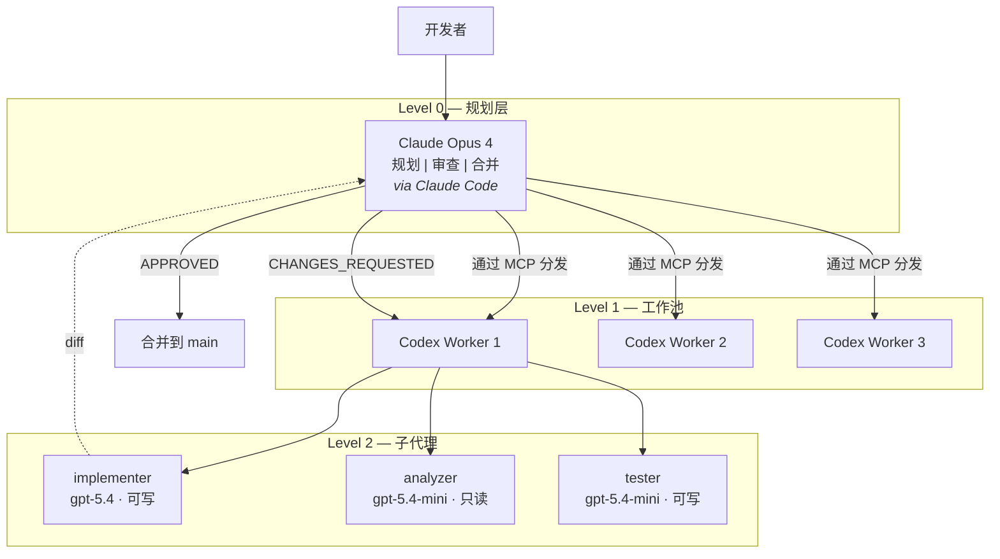

# Multi-Agent Dev Framework

零自定义代码的多智能体协同开发框架：Claude Opus 负责规划和审查，Codex CLI 工作池并行实现。

[](LICENSE)
[](CONTRIBUTING.md)

**中文** | [English](README.md)

## 为什么选择这个框架

- **零自定义代码** -- 纯配置驱动，无需编排脚本。Codex CLI + MCP 桥接 = 自包含工作节点。
- **对抗式审查循环** -- Claude 审查 GPT 的输出，在合并前捕获错误。最多 3 轮迭代。
- **并行执行** -- 最多 3 个工作节点同时运行，各自在独立的 git worktree 中工作，不会产生合并冲突。
- **模型分工** -- 复杂实现用 gpt-5.4，受限的分析和测试任务用更经济的 gpt-5.4-mini。

## 架构



### 编排流程

```
开发者请求
  → Claude Opus 制定方案
  → 方案审查
  → 分发 1-3 个 Codex Worker（并行，通过 MCP）
    → 每个 Worker 生成 analyzer/implementer/tester 子代理
    → Worker 在隔离的 git worktree 中实现
  → Claude Opus 审查所有 diff（对抗式审查）
  → APPROVED 或 CHANGES_REQUESTED（最多 3 轮）
  → 合并到 main
```

## 前置条件

| 工具 | 用途 | 安装 |
|------|------|------|
| [Claude Code](https://docs.anthropic.com/en/docs/claude-code) | Level 0 规划器/审查器 | `npm i -g @anthropic-ai/claude-code` |
| [Codex CLI](https://github.com/openai/codex) | Level 1 工作节点 | `npm i -g @openai/codex` |
| [codex-as-mcp](https://github.com/kky42/codex-as-mcp) | MCP 桥接 | 通过 `uvx` 自动安装 |
| tmux（可选） | 会话管理 | `apt install tmux` / `brew install tmux` |

### 订阅要求

- 1x **Claude Max**（Opus 4）-- 规划器和审查器
- 1-3x **ChatGPT Plus** -- 工作池（每个账号 = 1 个 Codex Worker）

## 快速开始

```bash
# 1. 安装 Codex CLI
npm i -g @openai/codex

# 2. 登录你的 GPT Plus 账号
codex login

# 3. 在 Claude Code 中注册 MCP 桥接
claude mcp add codex-sub -- uvx codex-as-mcp@latest
```

完成。Claude Code 现在可以通过 MCP 分发 Codex 工作节点了。

## 在新项目中使用

### 第一步：复制框架文件

```bash
cp -r ~/multi-agent-dev-framework/{codex.toml,.codex,docs,notes} /path/to/your-project/
```

这会为你的项目添加以下结构：

```
your-project/
├── codex.toml                            # Codex 项目配置
├── .codex/
│   ├── agents/
│   │   ├── implementer.toml              # 代码编写器 (gpt-5.4)
│   │   ├── analyzer.toml                 # 只读分析器 (gpt-5.4-mini)
│   │   └── tester.toml                   # 测试编写器 (gpt-5.4-mini)
│   └── skills/
│       └── repo-working-memory/          # 持久化上下文技能
│           ├── SKILL.md
│           ├── scripts/
│           │   ├── init-worklog.sh
│           │   └── check-complete.sh
│           └── templates/
│               ├── task_plan.md
│               ├── findings.md
│               └── progress.md
├── docs/skills/
│   └── external-skill-review.md          # 技能治理策略
└── notes/working-memory/                 # 任务追踪目录
```

### 第二步：自定义 codex.toml（可选）

```toml
[model]
default = "gpt-5.4"          # 选择你喜欢的模型

[agents]
max_threads = 3               # 如果有更多 GPT Plus 账号可以增大
max_depth = 1                  # 保持扁平，避免嵌套爆炸

[sandbox]
mode = "write-allow"
```

### 第三步：为项目添加 AGENTS.md（推荐）

在项目根目录创建 `AGENTS.md`，让工作节点了解项目：

```md
# Repo Notes

- Language: Python 3.12 / TypeScript 5.x
- Run tests with: `pytest -q` / `npm test`
- Run lint with: `ruff check .` / `eslint .`
- Keep patches minimal.
- Do not edit generated files unless explicitly asked.
```

### 第四步：开始开发

```bash
# 在你的项目目录中：
claude                         # 启动 Claude Code（规划器）

# 当你要求并行实现功能时，Claude 会自动通过 MCP 分发工作节点
```

## 工作流模式

### 模式 A：单一功能

```
你 → Claude: "实现功能 X"
Claude → 制定方案
Claude → 通过 MCP 分发 implementer 工作节点
Claude → 审查 diff
Claude → 批准或要求修改
```

### 模式 B：并行实现

适用于包含多个独立组件的大型任务。

```
你 → Claude: "并行实现功能 X、Y、Z"

Claude 分发：
  Worker 1 (implementer) → 功能 X
  Worker 2 (implementer) → 功能 Y
  Worker 3 (implementer) → 功能 Z

Claude 审查所有 diff → 合并
```

### 模式 C：完整流水线（含子代理）

```
你 → Claude: "先分析再实现功能 X"

Claude 分发 Worker 1：
  └── analyzer 子代理 → 报告依赖和接口
  └── implementer 子代理 → 基于分析结果编写代码
  └── tester 子代理 → 编写并运行测试

Claude 审查综合输出 → 合并
```

## 工作记忆

对于跨多个会话的复杂任务，使用内置的工作记忆技能：

```bash
# 为新任务初始化追踪
sh .codex/skills/repo-working-memory/scripts/init-worklog.sh my-feature

# 创建的文件：
# notes/working-memory/my-feature/task_plan.md   -- 目标、阶段、决策
# notes/working-memory/my-feature/findings.md    -- 事实、约束
# notes/working-memory/my-feature/progress.md    -- 操作日志、测试结果

# 检查所有阶段是否完成
sh .codex/skills/repo-working-memory/scripts/check-complete.sh my-feature
```

## 配置参考

### codex.toml（项目级）

| 参数 | 默认值 | 说明 |
|------|--------|------|
| `model.default` | `gpt-5.4` | 根代理的默认模型 |
| `agents.max_threads` | `3` | 每个 Worker 的最大并发子代理线程数 |
| `agents.max_depth` | `1` | 嵌套深度（1 = 仅直接子代理） |
| `sandbox.mode` | `write-allow` | 默认沙箱模式 |

### 代理配置

| 代理 | 模型 | 沙箱 | 职责 |
|------|------|------|------|
| `implementer` | gpt-5.4 | write-allow | 编写生产代码 |
| `analyzer` | gpt-5.4-mini | read-only | 分析依赖和接口 |
| `tester` | gpt-5.4-mini | write-allow | 编写和运行测试 |

### Codex CLI 配置文件（~/.codex/config.toml）

推荐的日常使用配置：

```toml
[profiles.dev]
model = "gpt-5.4"
approval_policy = "on-request"
sandbox_mode = "workspace-write"
model_reasoning_effort = "medium"
model_verbosity = "medium"
web_search = "disabled"

[profiles.review]
model = "gpt-5.4"
approval_policy = "on-request"
sandbox_mode = "read-only"
model_reasoning_effort = "high"
model_verbosity = "medium"
web_search = "disabled"
```

使用方式：
- `codex -p dev` -- 日常开发
- `codex -p review` -- 只读调查或代码审查

## 技能治理

安装外部 Codex 技能前，按照 `docs/skills/external-skill-review.md` 中的策略进行审查：

- **允许**：官方 `openai/skills`，用于有界任务
- **先 Fork**：影响工作流行为的社区技能
- **拒绝**：部署/上传类技能、无人维护的项目、`curl|bash` 安装器

## 反模式

- 不要默认使用 `danger-full-access` 沙箱模式
- 不要在非必要时启用网络访问
- 不要在同一个 worktree 中同时运行多个代理
- 不要将子代理嵌套超过 1 层
- 不要跳过审查循环 -- 对抗式审查是这个框架的核心价值

## 文件清单

| 文件 | 用途 |
|------|------|
| `codex.toml` | 项目级 Codex 配置（模型、线程、沙箱） |
| `.codex/agents/implementer.toml` | GPT-5.4 代码编写子代理 |
| `.codex/agents/analyzer.toml` | GPT-5.4-mini 只读分析子代理 |
| `.codex/agents/tester.toml` | GPT-5.4-mini 测试编写子代理 |
| `.codex/skills/repo-working-memory/` | 持久化上下文追踪技能 |
| `docs/skills/external-skill-review.md` | 外部技能治理策略 |
| `notes/working-memory/` | 活跃任务追踪目录 |

## 关键设计决策

1. **零自定义代码**：Codex CLI + MCP = 自包含工作节点，无需编排脚本。
2. **保守并发**：`max_threads=3, max_depth=1` 防止配额耗尽和嵌套爆炸。
3. **模型分工**：gpt-5.4 处理复杂实现，gpt-5.4-mini 处理受限的分析/测试。
4. **仓库本地记忆**：工作记忆保留在仓库中，绝不读取主目录或会话文件。
5. **扁平层级**：仅直接子代理，无孙代理。保持执行可预测。

## tmux 配置（可选）

用于多窗格开发的 `~/.tmux.conf` 最小配置：

```tmux
set -g mouse on
set -g history-limit 100000
set -g renumber-windows on
set -g base-index 1
setw -g pane-base-index 1

set -g status-position bottom
set -g allow-passthrough on

bind r source-file ~/.tmux.conf \; display-message "tmux reloaded"
bind | split-window -h -c "#{pane_current_path}"
bind - split-window -v -c "#{pane_current_path}"
bind c new-window -c "#{pane_current_path}"
```

推荐布局：
- **窗格 1**：`claude`（规划器）或 `codex -p dev`（工作节点）
- **窗格 2**：`pytest -f` / `npm test -- --watch` / 服务日志

## 参考链接

- [Codex CLI](https://github.com/openai/codex)
- [codex-as-mcp](https://github.com/kky42/codex-as-mcp)
- [Claude Code](https://docs.anthropic.com/en/docs/claude-code)
- [Claude Code Worktree Workflows](https://docs.anthropic.com/en/docs/claude-code/common-workflows)

## 许可证

[MIT](LICENSE) -- fzhiy
