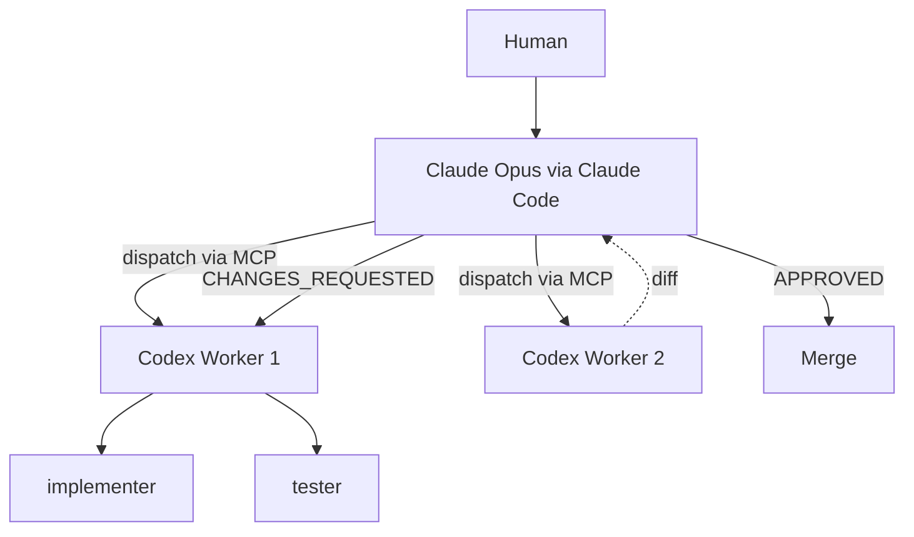
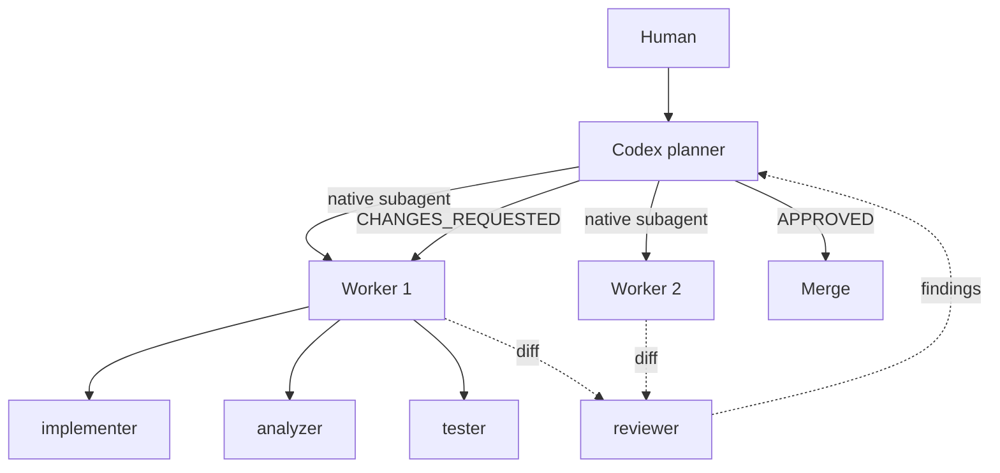

# Codex-Only Mode Guide

## Overview

Codex-only mode runs the framework entirely inside Codex CLI. The root `planner` agent handles spec creation, planning, dispatch, review, and merge coordination with native subagents, so you can keep the multi-agent workflow without Claude Code or an MCP bridge.

Use codex-only mode when you want a single-provider setup, lower subscription overhead, or a simpler local install. Hybrid mode remains useful when you want cross-model adversarial review and Claude Code slash commands.

## Prerequisites

- Codex CLI installed
- ChatGPT Plus subscription
- No Claude Code or MCP bridge needed

## Setup

1. Copy the framework files into your project. For codex-only mode you can skip `.claude/` if you are not using hybrid mode.

```bash
cp -r ~/multi-agent-dev-framework/{codex.toml,.codex,docs,notes} /path/to/your-project/
```

2. Edit `codex.toml` and set `framework.mode = "codex-only"`.

```toml
[framework]
mode = "codex-only"
enhanced_review = false
```

3. Optional: set `framework.enhanced_review = true` if you have the extra codex-review MCP path configured for a second review pass.

## Usage

### Starting the Planner

```bash
codex --agent planner
```

### Workflow Walkthrough

This is the expected feature-development cycle in codex-only mode.

#### Step 1: Spec

Prompt:

```text
Write a spec for a REST API endpoint that returns user profiles
```

What happens:
- The `codex-spec` skill is auto-matched.
- A structured spec is produced, typically in `spec.md` or your repo's working-memory location.
- The planner confirms scope and acceptance criteria before dispatching implementation work.

#### Step 2: Plan

Prompt:

```text
Create a plan from this spec
```

What happens:
- The `codex-plan` skill is auto-matched.
- The planner creates an implementation plan with dependencies, parallelization groups, and validation steps.
- The plan is usually saved as `task_plan.md` or under `notes/working-memory/<task>/task_plan.md`.

#### Step 3: Dispatch

Prompt:

```text
Dispatch workers
```

What happens:
- The `codex-dispatch` skill is auto-matched.
- The planner creates worktrees or isolated branches as needed.
- Native subagent workers are spawned for the selected tasks.
- Each worker can spawn `implementer`, `analyzer`, and `tester` subagents for bounded execution.

#### Step 4: Review

Prompt:

```text
Review the worker output
```

What happens:
- The `codex-review` skill is auto-matched.
- The planner spawns the `reviewer` subagent in read-only mode.
- Findings are reported as `APPROVED` or `CHANGES_REQUESTED`, with concrete file-level issues when changes are needed.
- If `framework.enhanced_review = true`, an additional review pass can run through the configured MCP review path.

#### Step 5: Merge

Prompt:

```text
Merge approved branches
```

What happens:
- The planner verifies that review gates passed.
- Approved branches are merged after user confirmation.
- Temporary worktrees can be cleaned up once the merge is complete.

## Architecture Comparison

### Hybrid Mode



Hybrid mode keeps Claude as the planner and reviewer. Codex workers are still responsible for implementation, but dispatch and review cross the MCP bridge.

### Codex-Only Mode



Codex-only mode keeps the full loop inside Codex CLI. The same tool handles planning, worker orchestration, and review, with a dedicated `reviewer` agent preserving separation between implementation and evaluation.

### Trade-offs

| Aspect | Hybrid | Codex-Only |
|--------|--------|------------|
| Subscriptions | Claude Max + GPT Plus | GPT Plus only |
| Review quality | Cross-model adversarial | Same-model + checklist |
| Interaction | Slash commands | Natural language |
| MCP bridge | Required | Not needed |

## Configuration Reference

Use these `codex.toml` options to control codex-only mode:

| Parameter | Default | Description |
|-----------|---------|-------------|
| `model.default` | `gpt-5.4` | Default model for the root agent |
| `agents.max_threads` | `3` | Max concurrent subagent threads per worker |
| `agents.max_depth` | `1` | Nesting depth for subagents |
| `sandbox.mode` | `write-allow` | Default sandbox mode for the root agent |
| `framework.mode` | `hybrid` | Set to `"codex-only"` to enable planner-led native orchestration |
| `framework.enhanced_review` | `false` | Enables a second-round MCP review path in codex-only mode |

Related agent files:
- `.codex/agents/planner.toml`
- `.codex/agents/reviewer.toml`
- `.codex/agents/implementer.toml`
- `.codex/agents/analyzer.toml`
- `.codex/agents/tester.toml`

## Troubleshooting

### Single Account Rate Limits

If you are running codex-only mode on a single ChatGPT Plus account, start conservatively:

- Set `agents.max_threads = 1` or `2` before trying `3`.
- Keep `agents.max_depth = 1` to avoid nested fan-out.
- Prefer shorter review cycles over dispatching all work at once.

### Agent Invocation

The expected entrypoint is:

```bash
codex --agent planner
```

If your installed Codex CLI build does not support `--agent`, update Codex CLI first. If your build exposes an equivalent named-agent invocation, use that syntax while still targeting the `planner` agent defined in `.codex/agents/planner.toml`.

### Skill Auto-Matching

Codex-only mode relies on natural-language prompts that match the codex-specific skills:

- `codex-spec`
- `codex-plan`
- `codex-dispatch`
- `codex-review`
- `codex-status`

If auto-matching misses, use more explicit prompts such as `Write a spec`, `Create a plan`, `Dispatch workers`, `Review the worker output`, or `Show task status`.

## FAQ

**Do I need `.claude/commands/` in codex-only mode?**

No. Those slash commands are for hybrid mode. Codex-only mode uses natural-language prompts instead.

**Can the same repo support both modes?**

Yes. Keep both sets of files and switch `framework.mode` between `"hybrid"` and `"codex-only"` as needed.

**Is review weaker in codex-only mode?**

Usually yes, compared with hybrid cross-model review. The dedicated `reviewer` agent and `framework.enhanced_review` option reduce that gap, but hybrid mode still provides stronger model diversity.

**Can one account run three workers?**

Sometimes, but it is not the best default. A single account should usually start with fewer concurrent threads to avoid rate-limit churn.
